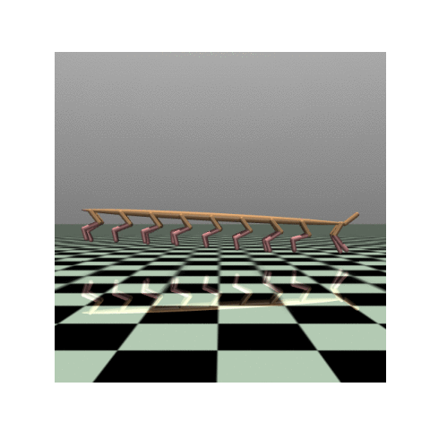
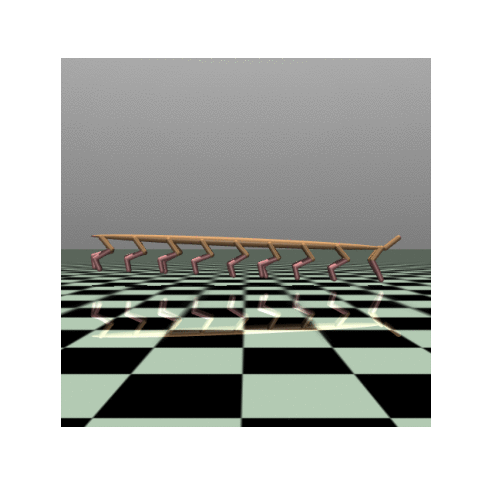

# Exploring GNNs in RL locomotion tasks

This repo contains software used in a master's thesis: Exploring Graph Neural Networks in Reinforcement Learning: A Comparative Study on Architectures for Locomotion Tasks.

The main PPO code was referenced from [PPO for Beginners](https://github.com/ericyangyu/PPO-for-Beginners)

Custom environments were created referencing Mujoco Environments from [Gymnasium](https://gymnasium.farama.org/environments/mujoco/)

GNN based policy networks were created referencing [PyTorch Geometric](https://pytorch-geometric.readthedocs.io/en/latest/get_started/colabs.html) and [PyTorch Geomertic Temporal](https://pytorch-geometric-temporal.readthedocs.io/en/latest/notes/introduction.html)

It also contains a visualization of results, obtained using this software.

## Results Visualization

### 6-legged creature

| FNN                                    | RecGCN                                           |
| -------------------------------------- | ------------------------------------------------ |
|  |  |

### 10-legged creature

| FNN                                     | RecGCN                                     |
| --------------------------------------- | ------------------------------------------ |
|  |  |

### 18-legged creature

| FNN                               | RecGCN                               |
| --------------------------------- | ------------------------------------ |
|  |  |

